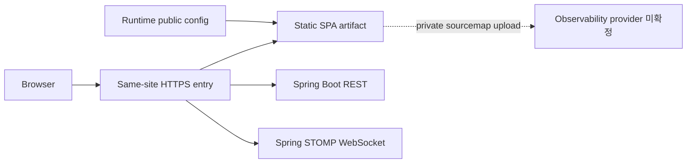

# Deployment View

## 목적

FE 정적 artifact와 BE REST/STOMP가 same-site 경계에서 연결되는 논리 topology를 나타낸다.

## 전체 FE 배포 Topology

## FE/BE 네트워크 경계

- browser는 same-site 상대 경로를 사용한다.
- session cookie는 browser와 BE가 처리하며 JavaScript가 읽지 않는다.
- REST 변경 요청과 STOMP CONNECT는 fixed 계약에 따른 CSRF 값을 사용한다.
- WebSocket Origin과 destination 권한은 BE가 최종 검증한다.

## Hosting/CDN/Reverse Proxy 구성

- HTTPS entry가 static route, history fallback, API proxy, WebSocket upgrade, security header를 담당한다.
- CDN은 hashed asset에만 선택적으로 둔다.
- 실제 제품과 path는 미확정이다.

## 환경별 차이

- artifact는 동일하다.
- runtime public config, proxy target, observability environment와 release promotion 상태만 달라질 수 있다.
- production은 stage를 통과한 checksum을 사용한다.

## Runtime Config 주입

- deploy adapter가 public config file을 제공한다.
- app bootstrap이 schema를 검증한다.
- config에는 secret을 넣지 않는다.

## 정적 자산 흐름

- build는 content hash asset과 manifest를 만든다.
- stage와 prod는 같은 artifact를 사용한다.
- index/runtime config는 asset과 다른 cache policy를 사용한다.

## Client Observability 흐름

- app은 vendor-neutral adapter로 제한된 telemetry만 전송한다.
- release sourcemap은 public hosting이 아니라 선택한 provider에 private upload한다.
- 민감 payload는 telemetry와 sourcemap metadata에서 제외한다.
